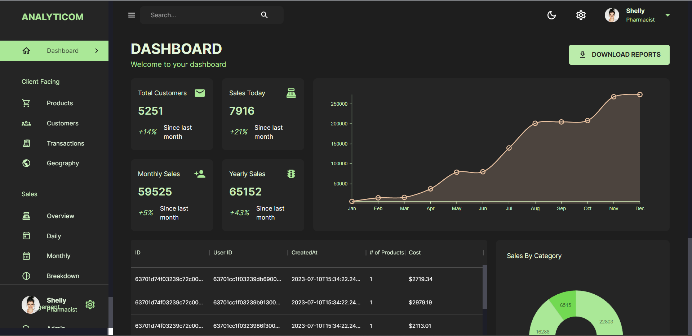
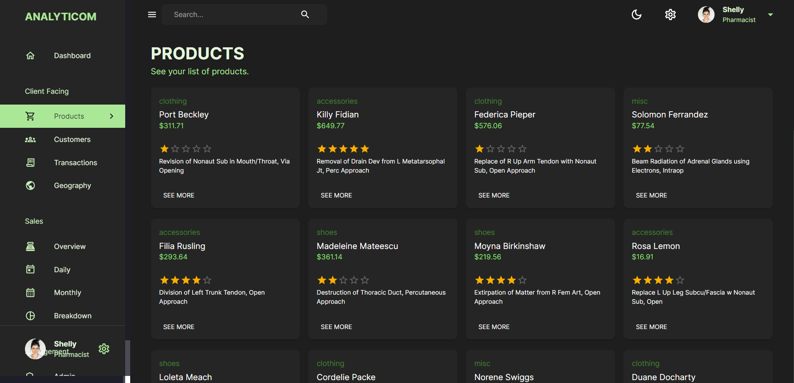
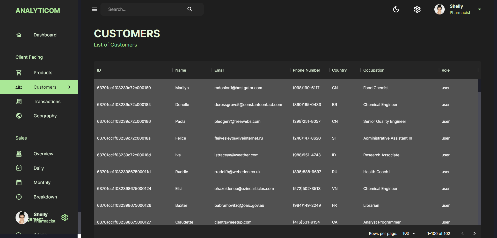
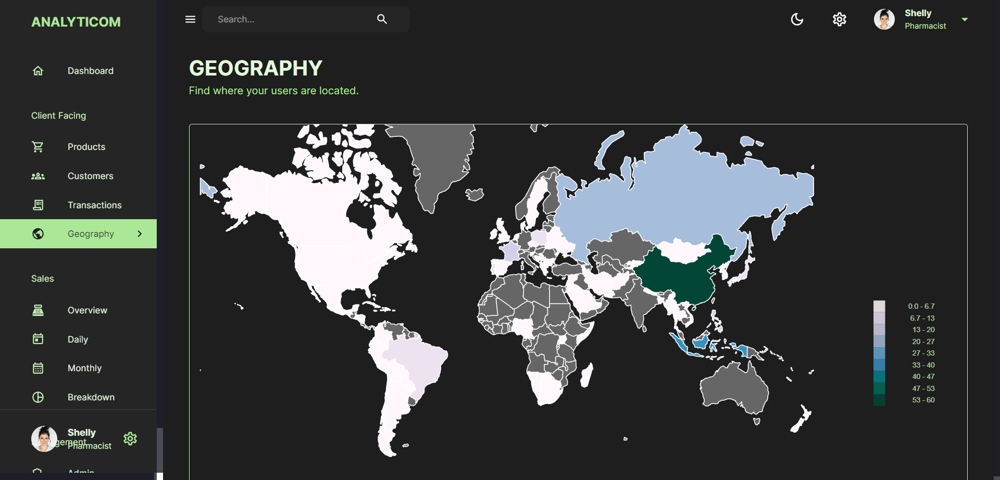
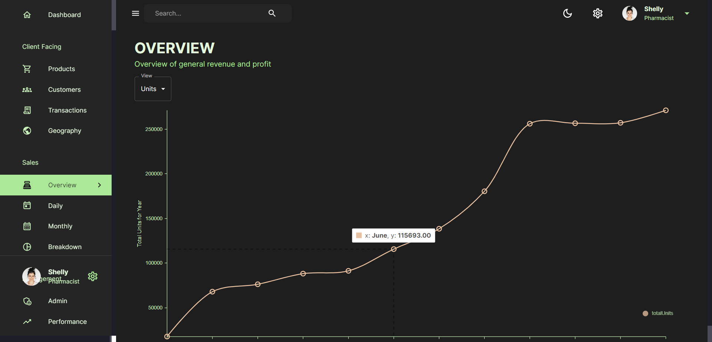
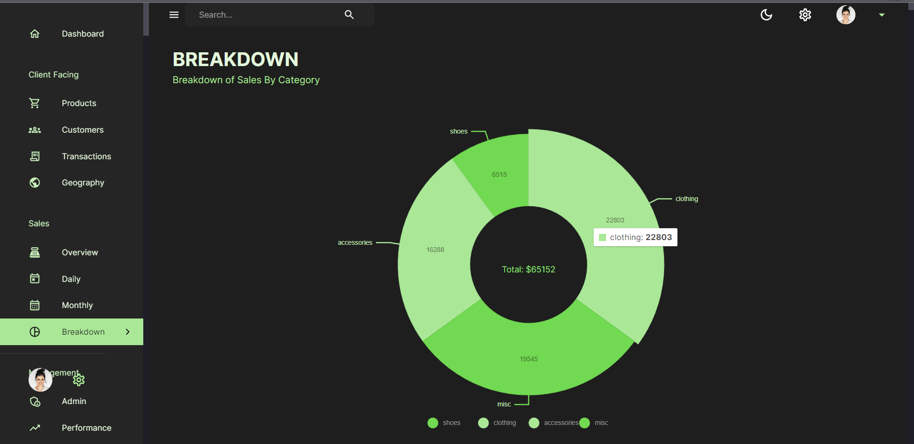

# Analyticom Admin Dashboard
This an all responsiove website which gives the user statistics on sales and user information. It helps the admin track various ascpects of the data such as:
* Total Customers, monthly yearly and total sales 
* Graphs showing the monthly sales over the past year and pie-charts for distribution of sales
* Customer details, all the products purchased and the transactions made by the consumers.
* A intuitive map representing where the users are from.
* detailed overview of daily, monthly breakdown of sales

Analyticom is a MERN full stack application which uses Material UI, Material UI datagrid for Tables, Nivo for charts and redux toolkit for state management. It uses NodeJs for runtime, Express Js for backend framework, Mongo DB for database and Mongoose for Database Modeling.

## Tech-Stack used :

  
  
  
  
  
  
  
  
  
  

